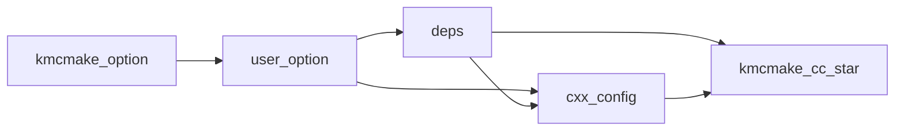

# From a plain CMake project to kmcmake

Map a normal CMake tree onto kmcmake **user** files. Do not put project policy in `kmcmake/`.

Load order (already in the generated root `CMakeLists.txt`):

1. `include(kmcmake_module)` — framework options (`kmcmake_option.cmake`)
2. `include(<proj>_user_option OPTIONAL)` — **your** options / overrides
3. `include(<proj>_deps)` — find packages according to those options
4. `include(<proj>_cxx_config)` — flags from options + what deps require
5. `add_subdirectory(<proj>)` — only consume `KMCMAKE_DEPS_LINK` / `KMCMAKE_CXX_OPTIONS`

## `option()` → `cmake/*_user_option.cmake`

| Plain CMake | kmcmake |
|-------------|---------|
| `option(FOO_ENABLE_BAR …)` in root `CMakeLists.txt` | `option()` / `set(… CACHE …)` in `*_user_option.cmake` |
| Force SIMD / tests / CPM | `set(KMCMAKE_RUNTIME_SIMD_LEVEL … CACHE STRING "" FORCE)` and the same for `KMCMAKE_BUILD_TEST`, `KMCMAKE_USE_CPM`, … |
| Extra flags that are **policy** (always on) | `list(APPEND KMCMAKE_CXX_OPTIONS …)` here **or** in `*_cxx_config.cmake` after aggregation |

Do not add new `option()` in `<project>/CMakeLists.txt` or in `kmcmake/`.

## Deps follow options → `cmake/*_deps.cmake`

| Plain CMake | kmcmake |
|-------------|---------|
| `find_package(ZLIB)` in the root file | `find_package` / `kmcmake_private_find_package` in `*_deps.cmake` |
| `if(FOO_WITH_SSL) find_package(OpenSSL)` | Same `if()` using the option from `*_user_option.cmake` |
| `target_link_libraries(… ZLIB::ZLIB)` | `list(APPEND KMCMAKE_DEPS_LINK ZLIB::ZLIB)` then `LINKS`/`PLINKS ${KMCMAKE_DEPS_LINK}` |
| FetchContent / CPM | `KMCMAKE_USE_CPM=ON` + `*_cpm.cmake` (small / test-only deps). Large graphs: vcpkg preset |
| vcpkg toolchain | `--preset=vcpkg*` — not `find_package` auto-detect of `VCPKG_ROOT` |

`*_deps.cmake` may `if (KMCMAKE_BUILD_TEST)` / `if (FOO_WITH_X)` before `find_package`. Do not `find_package` in `<project>/CMakeLists.txt`. Test-only gtest may stay in `tests/CMakeLists.txt`.

## Flags follow options + deps → `cmake/*_cxx_config.cmake`

| Plain CMake | kmcmake |
|-------------|---------|
| `set(CMAKE_CXX_STANDARD 17)` | Default in `*_cxx_config.cmake` only if unset. Outer `-DCMAKE_CXX_STANDARD=`, preset `cacheVariables`, parent `add_subdirectory`, or `*_user_option.cmake` wins. |
| `if(ZLIB_FOUND) add_definitions(-DHAVE_ZLIB)` | `if()` in `*_cxx_config.cmake` (deps already ran) |
| Per-target `target_compile_options` as global policy | Do not; pass `${KMCMAKE_CXX_OPTIONS}` as `CXXOPTS` |

Framework already fills `KMCMAKE_BASE_CXX_FLAGS` and `KMCMAKE_SIMD_CXX_FLAGS`. Append project flags **below** that `set(KMCMAKE_CXX_OPTIONS …)` block.

## Targets

Replace `add_library` / `add_executable` / `add_test` with `kmcmake_cc_library` / `kmcmake_cc_binary` / `kmcmake_cc_test` (see `docs/AI.md`). Default exported target is `${PROJECT}::skills` (`skills.h`, `version.h`).

## Presets

Do not copy a one-off `cmake -S . -B build`. Use `CMakePresets.json`: empty / `cpm*` / `vcpkg*` × `default`/`test`/`test-bm`/`all` (Ninja; `-make` for Unix Makefiles).
